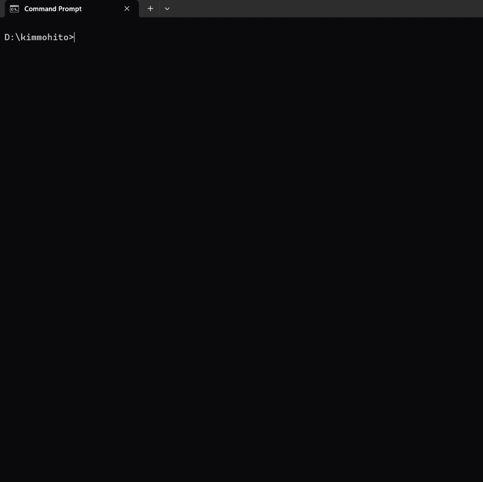
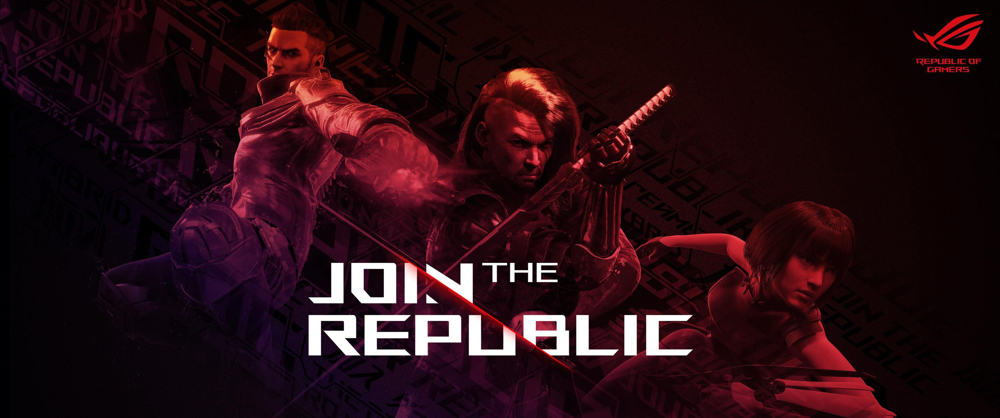

##  Hello world! Please be seated. 



- 👨‍💻 I'm the result `10years+` of `code`, `laugh`, `repeat`.
- 💻 I run `vscode` on `windows`.
- 🏗️ I `architect`, `design`, and `build` robust solutions for the `internet`.
- 📦 My stack `flutter/dart`, `capacitor/cordova`, `nextjs/react`, `nuxtjs/vue`, `javascript/typescript`, `laravel`, `tailwind`, `docker`, `kubernetes`.
- 🚀 DevOps-friendly. `code` > `commit` > `push` > `deploy`.
- 🕹️ Currently `exploring` the depth of `webassembly`, `rust`, `godot`.

### Try me:
```
npx kimmohito-card
```
### Time I've wasted:

[](https://wakatime.com/@kimmohito)

"I’m not lucky. I’m just determined and I keep showing up"

### Join The Republic:

[](https://rog.asus.com/elite/)

### My Gaming & Dev Workstation:

<table>
<tr>
<th>
Image
</th>
<th>
Name
</th>
<th>
Price
</th>
</tr>

<tr>
<td>
<a  target="_blank" href="https://rog.asus.com/laptops/rog-strix/rog-strix-scar-18-2025/">

</a>
</td>
<td>
<a  target="_blank" href="https://rog.asus.com/my/laptops/rog-flow/rog-flow-z13-2023-series/spec">
ROG Strix Scar 18 (2025)
</a><br/>
CPU: Intel® Core™ Ultra 9<br/>
NPU: Intel® AI Boost NPU<br/>
GPU: NVIDIA® GeForce RTX™ 5090<br/>
RAM: 32GB + <a  target="_blank" href="https://s.shopee.com.my/1BBhFFKPos">32GB Kingston DDR5-5600 SO-DIMM (RM469.00)</a><br/>
SSD: 4TB + <a  target="_blank" href="https://s.shopee.com.my/9zn5lSin8D">4TB Samsung 9100 PRO M.2 PCIe® 4.0 NVMe™ Performance SSD (RM2,999.00)</a><br/>
</td>
<td>
<a  target="_blank" href="https://s.shopee.com.my/6VDDahNdoG">
RM25,999.00
</a>
</td>
</tr>

<tr>
<td>
<a  target="_blank" href="https://rog.asus.com/my/laptops/rog-flow/rog-flow-z13-2023-series/gallery">

</a>
</td>
<td>
<a  target="_blank" href="https://rog.asus.com/laptops/rog-flow/rog-flow-z13-2025/spec">
ROG Flow Z13 (2025) GZ302
</a><br/>
CPU: AMD Ryzen™ AI MAX+ 395</br>
NPU: AMD XDNA™<br/>
GPU: AMD Radeon™ 8060S<br/>
RAM: 32GB LPDDR5X 8000 on board<br/>
SSD: 1TB PCIe® 4.0 NVMe™ M.2 (2230)<br/>
Weight: 1.20 Kg (2.65 lbs)
</td>
<td>
<a  target="_blank" href="https://s.shopee.com.my/3LGBoup2lk">
RM10,999.00
</a>
</td>
</tr>

<tr>
<td>
<a  target="_blank" href="https://rog.asus.com/gaming-handhelds/rog-ally/rog-ally-x-2024/gallery/">

</a>
</td>
<td>
<a  target="_blank" href="https://rog.asus.com/gaming-handhelds/rog-ally/rog-ally-x-2024/spec/" target="_blank">
ROG Ally X (2024) RC72LA
</a><br/>
CPU: AMD Ryzen™ Z1 Extreme</br>
GPU: AMD Radeon™ Graphics<br/>
RAM: 12GB*2 LPDDR5 on board<br/>
SSD: 1TB PCIe® 4.0 NVMe™ M.2 SSD (2280)<br/>
Weight: 678 g (1.49 lbs)
</td>
<td>
<a  target="_blank" href="https://s.shopee.com.my/1VoXdZwnQo">
RM4,299.00
</a>
</td>
</tr>

<!-- <tr>
<td>
<a  target="_blank" href="https://rog.asus.com/external-graphic-docks/rog-xg-mobile-2025/gallery/">

</a>
</td>
<td>
<a  target="_blank" href="https://rog.asus.com/us/external-graphic-docks/rog-xg-mobile-2023-model/spec">
ROG XG Mobile (2025)
</a><br/>
The XG Mobile combines the power of an external GPU with the expandability of a Thunderbolt Dock and puts it all into an extremely portable package the size of a hardcover novel. Boasting up to an NVIDIA® GeForce RTX™ 5090 Laptop GPU, this portable powerhouse is designed to game at the highest levels. By leveraging the incredible bandwidth of Thunderbolt™ 5, the XG Mobile not only boosts your gaming performance, but also offers a host of connectivity options including wired ethernet and high-speed USB ports in one slim package. For gamers that need serious power without sacrificing their setup’s portability, or creators that need flagship rendering power from a single Thunderbolt™ connection, the ROG XG Mobile has arrived.
</td>
<td>
<a  target="_blank" href="https://shope.ee/8zhmO2vx18">
RM9,999.00
</a>
</td>
</tr> -->

<tr>
<td>
<a  target="_blank" href="https://rog.asus.com/monitors/above-34-inches/rog-swift-oled-pg49wcd/gallery/">

</a>
</td>
<td>
<a  target="_blank" href="https://rog.asus.com/monitors/above-34-inches/rog-swift-oled-pg49wcd/spec/">
ROG Swift OLED PG49WCD
</a>x2<br/>
ROG Swift OLED PG49WCD gaming monitor ― 49-inch (5120x1440) curved QD-OLED panel, 144 Hz, 0.03 ms, G-SYNC® compatible, custom heatsink, unifoRMbrightness, ROG Smart KVM, 90 W Type-C, ASUS DisplayWidget Center
</td>
<td>
<a  target="_blank" href="https://s.shopee.com.my/1LV7RJ0swD">
RM8,900.00
</a>
</td>
</tr>

<tr>
<td>
<a  target="_blank" href="https://rog.asus.com/us/monitors/accessories/rog-ergo-monitor-arm-aas01/gallery/">

</a>
</td>
<td>
<a  target="_blank" href="https://thearyl.com/product/fabulous-pole-mounted-heavy-duty-gas-spring-dual-monitor-arm/">
The Aryl™ Fabulous Pole-Mounted Heavy-Duty Gas Spring Dual Monitor Arm
</a><br/>
Compatible with most QLED, OLED, LED flat, and curved computer monitors ranging from 17'' to 49''. It can hold monitors up to 44 lbs for each arm. Compatible with the Samsung Odyssey G9, LG, and other 49" ultrawide monitors, you need to prepare a VESA mount adapter if your monitor does not have VESA holes.
</td>
<td>
<a  target="_blank" href="https://s.shopee.com.my/4flZRh1crA">
RM899.90
</a>
</td>
</tr>


<tr>
<td>
<a  target="_blank" href="https://rog.asus.com/monitors/32-to-34-inches/rog-swift-oled-pg34wcdm/gallery/">

</a>
</td>
<td>
<a  target="_blank" href="https://rog.asus.com/monitors/32-to-34-inches/rog-swift-oled-pg34wcdm/spec/">
ROG Swift OLED PG34WCDM
</a>x2<br/>
ROG Swift OLED PG34WCDM gaming monitor ― 34-inch (33.9 inch viewable, 3440 x 1440) 800R curved OLED panel, 240 Hz, 0.03 ms (GTG) response time, G-SYNC® compatible, custom heatsink, unifoRMbrightness, ROG Smart KVM, 90 W Type-C®, and ASUS DisplayWidget Center
</td>
<td>
<a  target="_blank" href="https://s.shopee.com.my/1VoXddXFzs">
RM7,099.00
</a>
</td>
</tr>

<tr>
<td>
<a  target="_blank" href="https://rog.asus.com/us/monitors/accessories/rog-ergo-monitor-arm-aas01/gallery/">

</a>
</td>
<td>
<a  target="_blank" href="https://rog.asus.com/monitors/32-to-34-inches/rog-swift-oled-pg34wcdm/spec/">
ROG Ergo Monitor ARMAAS01
</a>x2<br/>
ROG Ergo Monitor ARMAAS01 – A monitor mount that features cable management channels, allowing gamers to create a more ergonomic, neater gaming setup.
</td>
<td>
<a  target="_blank" href="https://s.shopee.com.my/9pTfYynrxg">
RM860.00
</a>
</td>
</tr>

<tr>
<td>
<a  target="_blank" href="https://rog.asus.com/keyboards/keyboards/aura-rgb/rog-claymore-ii-model/gallery">

</a>
</td>
<td>
<a  target="_blank" href="https://rog.asus.com/keyboards/keyboards/aura-rgb/rog-claymore-ii-model/spec">
ROG Claymore II Gaming Keyboard
</a><br/>
ROG Claymore II modular TKL 80%/100% gaming mechanical keyboard with ROG RX Optical Mechanical Switches, detachable numpad & wrist rest, wired & wireless 2.4G modes, extra customizable clicky hotkeys, volume control wheel and wireless Aura Sync.
</td>
<td>
<a  target="_blank" href="https://s.shopee.com.my/4ApIoavR1V">
RM1,099.00
</a>
</td>
</tr>

<tr>
<td>
<a  target="_blank" href="https://rog.asus.com/mice-mouse-pads/mice/ergonomic-right-handed/rog-chakram-x-origin-model/gallery">

</a>
</td>
<td>
<a  target="_blank" href="https://rog.asus.com/mice-mouse-pads/mice/ergonomic-right-handed/rog-chakram-x-origin-model/spec">
ROG Chakram X Origin
</a><br/>
ROG Chakram X wireless RGB gaming mouse with next-gen 36,000 dpi ROG AimPoint optical sensor, 8000 Hz polling rate, low-latency tri-mode connectivity (RF 2.4 GHz / Bluetooth / wired), 11 programmable buttons, an analog joystick and hot-swappable micro switch sockets (mechanical / optical ).
</td>
<td>
<a  target="_blank" href="https://s.shopee.com.my/AUjMMGAWAb">
RM719.00
</a>
</td>
</tr>

<tr>
<td>
<a  target="_blank" href="https://rog.asus.com/us/mice-mouse-pads/mouse-pads/rog-hone-ace-xxl/gallery/">

</a>
</td>
<td>
<a  target="_blank" href="https://rog.asus.com/us/mice-mouse-pads/mouse-pads/rog-hone-ace-xxl/spec/">
ROG Hone Ace XXL
</a><br/>
L 900 x W 400 x H 3 mm
</td>
<td>
<a  target="_blank" href="https://s.shopee.com.my/1BBhFChQ3N">
RM249.00
</a>
</td>
</tr>

<tr>
<td>
<a  target="_blank" href="https://rog.asus.com/controllers/rog-raikiri-pro-model/gallery">

</a>
</td>
<td>
<a  target="_blank" href="https://rog.asus.com/controllers/rog-raikiri-pro-model/spec">
ROG Raikiri Pro
</a><br/>
The ROG Raikiri Pro PC Controller features an OLED display, four rear buttons, selectable triggers, ESS DAC, customizable joystick sensitivity and response curves, and tri-mode connectivity. It’s ideal to play in wired USB-C, 2.4GHz, or Bluetooth on PCs
</td>
<td>
<a  target="_blank" href="https://s.shopee.com.my/AUjMMHehoe">
RM799.00
</a>
</td>
</tr>

<tr>
<td>
<a  target="_blank" href="https://rog.asus.com/headsets-audio/in-ear-headphone/rog-cetra-true-wireless-model/gallery">

</a>
</td>
<td>
<a  target="_blank" href="https://rog.asus.com/headsets-audio/in-ear-headphone/rog-cetra-true-wireless-model/spec">
ROG Cetra True Wireless
</a><br/>
ROG Cetra True Wireless gaming headphones with low-latency wireless connection, ANC, up to 27-hour battery with wireless-charging case, IPX4 water resistance and support for EQ/virtual 7.1 via Armoury Crate
</td>
<td>
<a  target="_blank" href="https://s.shopee.com.my/7ASuOBD3i6">
RM599.00
</a>
</td>
</tr>

<tr>
<td>
<a  target="_blank" href="https://rog.asus.com/storage/rog-strix-arion-model/gallery">

</a>
</td>
<td>
<a  target="_blank" href="https://rog.asus.com/storage/rog-strix-arion-model/spec">
ROG STRIX ARION
</a><br/>
ROG Strix Arion M.2 NVMe SSD Enclosure—USB3.2 Gen 2x1 Type-C (10 Gbps), Dual USB-C to C and USB-C to A Cables, Screwdriver-Free, Thermal Pads Included, Fits PCIe 2280/2260/2242/2230 M key/B+M Key
</td>
<td>
<a  target="_blank" href="https://shope.ee/3VMpeeQnid">
RM249.00
</a>
</td>
</tr>

<tr>
<td>
<a  target="_blank" href="https://rog.asus.com/networking/rog-rapture-gt-be98-pro/gallery/">

</a>
</td>
<td>
<a  target="_blank" href="https://rog.asus.com/networking/rog-rapture-gt-be98-pro/spec/">
ROG Rapture GT-BE98 Pro
</a><br/>
GT-BE98 Pro Quad-band WiFi 7 (802.11be) Gaming Router, support new 320MHz bandwidth & 4096-QAM, dual 10G ports, backup WAN, Triple-level Game Acceleration, Mobile Game Mode, AURA RGB, AiMesh support, subscription-free network security and comprehensive VPN features
</td>
<td>
<a  target="_blank" href="https://s.shopee.com.my/20koFdqtNZ">
RM3,988.00
</a>
</td>
</tr>

<tr>
<td colspan="2" style="text-align: right; font-weight: bold;">
Total
</td>
<td style="font-weight: bold;">
RM90,000.00~
</td>
</tr>


</table>

* Click on the [Image] to see more in galley
* Click on the [Name] to learn more about the specs
* Click on the [Price] to buy from shopee


<!-- | Icon | Item | Price (MYR) |
| - | - | - |
|  | [ROG FLow Z13 2023 (i9-13900H/1TB M.2/16GB DDR5/RTX4050)](https://shope.ee/8f4vnwyqgh) <br> + [2TB NVMe WD Black SN770M](https://shope.ee/6V0RH0WD93) | 8,999.00 <br> 1,139.00 |
|  | [ROG XG Mobile 2023 (16G GDDR6/RTX4090)](https://shope.ee/8zhmO2vx18) | 9,999.00 |
|  | [ROG Strix XG49VQ (49"/144Hz/Curved)](https://shope.ee/8f4vp0Tmx1) | 4,842.00 |
|  | [ROG Claymore II MA02](https://shope.ee/9zaJPCMJ8d) | 1,099.00 |
|  | [ROG Chakram X Origin P708](https://shope.ee/8KS5QXrkfZ) | 719.00 |
|  | [ROG Raikiri PRO](https://shope.ee/5fRKI5g23B) | 799.00 |
|  | [ROG Strix Arion](https://shope.ee/3VMpeeQnid) <br> + [4TB NVMe WD Black SN850X](https://shope.ee/4KvweShEDz) | 249.00 <br> 2,609.00 |
|  | [ROG Cetra Wireless Gaming Earbuds](https://shope.ee/B6O60YoTH) | 599.00 | -->

<!-- |  Icon | Name | Price (MYR) |
| - | - | - |

|  | [ROG Ally Z1](https://shope.ee/9exT22I5WV) <br> + [2TB NVMe WD Black SN770M](https://shope.ee/6V0RH0WD93) | 3,999.00 <br> 1,139.00 |

|  | [ROG SL300C Chariot](https://shope.ee/9exT3ZsVaK) | 2,600.00 |

|  | [ROG Phone 8 Pro (1TB/24GB)](https://shope.ee/g2eguXFEl) | 5,999.00 |

|  | [ROG AeroActive Cooler X for 8/8 Pro](https://shope.ee/9exTPQv3Uv) | 349.00 |


|  | [Apple Watch Ultra 2 (49mm/GPS+Cellular)](https://shope.ee/5V7uRjYCGM) | 3,799.00 |

|  | [Apple AirPods Pro 2nd-Gen (USB-C)](https://shope.ee/9KKd19jNBp) | 1,099.00 |

-->


<!-- ### My Camera Gears:

| Icon | Item | Price (MYR) |
| - | - | - |
|  | [Apple iPhone 15 Pro Black Titanium (1TB)](https://shope.ee/9A1CoUkETL) | 6,999.00 |
|  | [Canon EOS 80D + 18-55mm STM Lens](https://shope.ee/8KS6uPN3J2) | 5,299.00 |
|  | [Canon EOS M50 Mark II + 15-45mm Kit Lens](https://shope.ee/2q7AMNoq4O) | 3,199.00 |
|  | [Canon 50mm F/1.4 USM Ultrasonic Lens](https://shope.ee/5fRLjUP5FJ) | 1,999.00 |
|  | [Canon BG-E14 Battery Grip](https://shope.ee/3fgHLm2V87) | 249.00 |
|  | [Godox TT520II Camera Flash Speedlite](https://shope.ee/g2fmHZaLY) | 182.90 | -->


### My Tools:

<table>
<!-- ----- ----- ----- ----- ----- ----- ----- ----- ----- ----- -->
<tr>
<td>

#### Mobile

</td>
<td>

[](https://capacitorjs.com/)
[](https://reactnative.dev/)
[](https://flutter.dev/)
[](https://dart.dev/)
[](https://web.dev/learn/pwa/)

</td>
</tr>
<!-- ----- ----- ----- ----- ----- ----- ----- ----- ----- ----- -->
<tr>
<td>

#### Frameworks

</td>
<td>

[](https://nuxt.com/)
[](https://nextjs.org/)
[](https://expressjs.com/)
[](https://laravel.com/)
[](https://getcomposer.org/)
[](https://symfony.com/)
[](https://cakephp.org/)
[](https://codeigniter.com/)
[](https://svelte.dev/)
[](https://astro.build/)
[](https://jekyllrb.com/)
[](https://gohugo.io/)
[](https://gatsbyjs.com/)

</td>
</tr>
<!-- ----- ----- ----- ----- ----- ----- ----- ----- ----- ----- -->
<tr>
<td>

#### Frontend/UI

</td>
<td>

[](https://vuejs.org/)
[](https://vuetifyjs.com/)
[](https://react.dev/)
[](https://inertiajs.com/)
[](https://laravel-livewire.com/)
[](https://typescriptlang.org/)
[]
[](https://w3schools.com/js/)
[](https://tailwindcss.com/)
[](https://getbootstrap.com/)
[](https://sass-lang.com/)
[](https://bulma.io/)
[](https://w3schools.com/css/)
[](https://alpinejs.dev/)
[](https://chartjs.org/)
[](https://plotly.com/javascript/)
[](https://threejs.org/)
[](https://htmx.org/)
[](https://w3schools.com/html/)
[](https://markdownguide.org/)
[](https://tabler.io/)
[](https://fontawesome.com/)
[](https://material.io/)
[](https://mui.com/material-ui/material-icons/)
[](https://mui.com/)
[](https://getuikit.com/)
[](https://icons8.com/)
[](https://simpleicons.org/)
[](https://iconify.design/)
[](https://heroicons.com/)
[](https://sheilds.io/)
[](https://sheilds.io/)
[](https://unsplash.com/)

</td>
</tr>
<!-- ----- ----- ----- ----- ----- ----- ----- ----- ----- ----- -->
<tr>
<td>

#### Backend

</td>
<td>

[](https://nodejs.org/en/download)
[](https://php.net/downloads.php)
[](https://python.org/downloads/)
[](https://go.dev/dl/)
[](https://w3schools.com/c#/)
[](https://w3schools.com/c++/)
[](https://w3schools.com/c/)

</td>
</tr>
<!-- ----- ----- ----- ----- ----- ----- ----- ----- ----- ----- -->
<tr>
<td>

#### Databases

</td>
<td>

[](https://firebase.google.com/)
[](https://postgresql.org/)
[](https://mysql.com/)
[](https://mongodb.com/)
[](https://redis.io/)
[](https://aws.amazon.com/dynamodb/)
[](https://sqlite.org/)
[](https://w3schools.com/whatis/whatis_json.asp)
[](https://yaml.org/)
[](https://pgadmin.org/)
[](https://phpmyadmin.net/)
[](https://mysql.com/products/workbench/)
[](https://adminer.org/)
[](https://mongodb.com/docs/compass/master/)

</td>
</tr>
<!-- ----- ----- ----- ----- ----- ----- ----- ----- ----- ----- -->
<tr>
<td>

#### DevOps

</td>
<td>

[](https://axios-http.com/docs/intro)
[](https://graphql.org/)
[](https://jenkins.io/)
[](https://travis-ci.com/)

[](https://git-scm.com/)
[](https://github.com/)
[](https://pages.github.com/)
[](https://docs.github.com/en/actions)
[](https://github.com/features/copilot)
[](https://git-lfs.com/)
[](https://gitpod.io/)
[](https://git-scm.com/book/en/v2)
[](https://gitkraken.com/)
[](https://gitea.com/)
[](https://gitlab.com/)
[](https://bitbucket.org/)

[](https://npmjs.com/)
[](https://pnpm.io/)
[](https://bun.sh/)
[](https://yarnpkg.com/)
[](https://vitejs.dev/)
[](https://webpack.js.org/)
[](https://postcss.org/)
[](https://babeljs.io/)

[](https://apachefriends.org/download.html)
[](https://laragon.org/download/)
[](https://ngrok.com/download)
[](https://docker.com/get-started/)
[](https://vercel.com/)
[](https://digitalocean.com)
[](https://heroku.com/)
[](https://netlify.com/)
[](https://cloudflare.com/)
[](https://aws.amazon.com/)
[](https://aws.amazon.com/lambda/)
[](https://aws.amazon.com/s3/)
[](https://nginx.org/en/download.html)
[](https://projects.apache.org/releases.html)
[](https://hadoop.apache.org/releases.html)
[](https://kafka.apache.org/downloads)
[](https://cordova.apache.org/)

[](https://curl.se/)
[](#)
[](https://filezilla-project.org/)
[](https://filezilla-project.org/)
[](https://filezilla-project.org/)
[](https://filezilla-project.org/)
[](https://filezilla-project.org/)
[](https://filezilla-project.org/)
[](#)
[](https://cyberduck.io/)
[](https://filezilla-project.org/)


</td>
</tr>
<!-- ----- ----- ----- ----- ----- ----- ----- ----- ----- ----- -->
<tr>
<td>

#### Machine Learning

</td>
<td>

[](https://opencv.org/)
[](https://tensorflow.org/)
[](https://pytorch.org/)

</td>
</tr>
<!-- ----- ----- ----- ----- ----- ----- ----- ----- ----- ----- -->
<tr>
<td>

#### Testing/Security/Analyst

</td>
<td>

[](https://postman.com/)
[](https://selenium.dev/)
[](https://phpunit.de/)
[](https://laravel.com/docs/10.x/dusk)
[](https://zaproxy.org/)
[](https://portswigger.net/burp)
[](https://elastic.co/elastic-stack/)
[](https://elastic.co/elasticsearch)
[](https://elastic.co/logstash)
[](https://elastic.co/kibana)

</td>
</tr>
<!-- ----- ----- ----- ----- ----- ----- ----- ----- ----- ----- -->
<tr>
<td>

#### Content Management System (CMS)

</td>
<td>

[](https://wordpress.com/)
[](https://elementor.com/)
[](https://woo.com/)
[](https://shopify.com)
[](https://joomla.org/)
[](https://drupal.org/)

</td>
</tr>
<!-- ----- ----- ----- ----- ----- ----- ----- ----- ----- ----- -->
<tr>
<td>

#### Operating System

</td>
<td>

[](https://support.apple.com/macos)
[](https://microsoft.com/software-download/windows11)
[](https://raspberrypi.com/)
[](https://ubuntu.com/download)
[](https://kali.org/get-kali/#kali-platforms)
[](https://debian.org/)
[](https://alpinelinux.org/)
[](https://archlinux.org/)
[](https://centos.org/download/)
[](https://redhat.com/en/technologies/linux-platforms/enterprise-linux)
[](https://fedoraproject.org/)
[](https://suse.com/products/)
[](https://linuxmint.com/download.php)
[](https://download.lineageos.org/changes)

</td>
</tr>
<!-- ----- ----- ----- ----- ----- ----- ----- ----- ----- ----- -->
<tr>
<td>

#### Productivity

</td>
<td>

[](https://microsoft.com/en-us/edge/download)
[](https://code.visualstudio.com/)
[](https://wakatime.com/)
[](https://notion.so/)
[](https://1password.com/)
[](https://clickup.com/)
[](https://trello.com/)
[](https://anydesk.com/)

</td>
</tr>
<!-- ----- ----- ----- ----- ----- ----- ----- ----- ----- ----- -->
<tr>
<td>

#### Graphic Design

</td>
<td>

[](https://excalidraw.com/)
[](https://figma.com/)
[](https://canva.com/)
[](https://creativecloud.adobe.com/apps/download/xd)
[](https://creativecloud.adobe.com/apps/download/illustrator)
[](https://creativecloud.adobe.com/apps/download/dreamweaver)
[](https://creativecloud.adobe.com/apps/download/indesign)
[](https://creativecloud.adobe.com/apps/download/photoshop)
[](https://creativecloud.adobe.com/apps/download/lightroom-classic)
[](https://creativecloud.adobe.com/apps/download/premiere-pro)
[](https://creativecloud.adobe.com/apps/download/after-effects)
[](https://sketchup.com/)
[](https://lumion.com/product/buy)
[](https://autodesk.com/products/autocad/overview)


</td>
</tr>
<!-- ----- ----- ----- ----- ----- ----- ----- ----- ----- ----- -->
</table>
