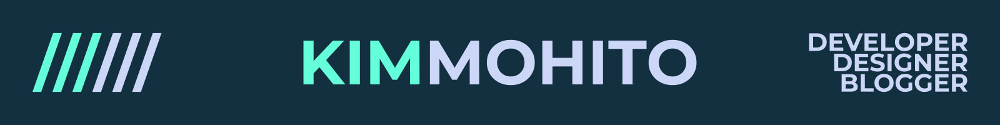

<!--##### HEADER #####-->

<!--##### ABOUT #####-->

## 👨‍💻 Hello World! 

My name is [Kim Mohito](https://kimmohito.github.io). I'm a certified [Network Engineer](#) by [Cisco](#), networking hardware company. Currently a part-time Web Developer and Programming Tutor, based in [Kuala Lumpur, Malaysia](https://www.google.com/maps/place/Kuala+Lumpur,+Federal+Territory+of+Kuala+Lumpur/data=!4m2!3m1!1s0x31cc49c701efeae7:0xf4d98e5b2f1c287d?sa=X&ved=2ahUKEwjp2te69e_sAhWozTgGHbhjCasQ8gEwK3oECAwQAQ) specializing in building (and occasionally designing) exceptional websites, applications, and everything in between. My goal is to always build products that provide pixel-perfect, performant experiences.

Shortly after graduating from [Diploma in Network Security](#) at [German Malaysian Institute](#), I pursue my [Degree in Network System](#) at [Universiti Kuala Lumpur MIIT](https://www.unikl.edu.my). I started a programming community in Malaysia known as [RojakCube](https://rojakcube.com). I joined the engineering team at [SilverByte](https://silverbyte.my) where I work on a wide variety of interesting and meaningful projects on a daily basis.

<!--##### RIGS A& GEARS #####-->

## 👷 My RIGs & Gears
<table>
<!-- Desktop -->
<tr><td></td><td><a href="https://www.google.com/search?q=MSI+GF63+Thin+95c&rlz=1C1CHBF_enMY920MY920&oq=MSI+GF63+Thin+95c&aqs=chrome..69i57.300j0j9&sourceid=chrome&ie=UTF-8">MSI GF63 Thin 95c</a></td></tr>
<!-- CPU -->
<tr><td></td><td><a href="https://www.google.com/search?q=Intel+Core+i5-9300h+2.40GHz&rlz=1C1CHBF_enMY920MY920&oq=Intel+Core+i5-9300h+2.40GHz&aqs=chrome..69i57.553j0j9&sourceid=chrome&ie=UTF-8">Intel Core i5-9300h 2.40GHz</a></td></tr>
<!-- SSD -->
<tr><td></td><td><a href="https://www.google.com/search?q=1TB+Kingston+NVMe+M.2&rlz=1C1CHBF_enMY920MY920&oq=1TB+Kingston+NVMe+M.2&aqs=chrome..69i57j69i60j69i61.294j0j4&sourceid=chrome&ie=UTF-8">1TB Kingston NVMe M.2</a></td></tr>
<!-- HDD -->
<tr><td></td><td><a href="https://www.google.com/search?q=1TB+Seagate+SATA+2.5%22+5400RPM&rlz=1C1CHBF_enMY920MY920&oq=1TB+Seagate+SATA+2.5%22+5400RPM&aqs=chrome..69i57.608j0j9&sourceid=chrome&ie=UTF-8">1TB Seagate SATA 2.5" 5400RPM</a></td></tr>
<!-- RAM-->
<tr><td></td><td><a href="https://www.google.com/search?q=16GB+DDR4+Kingston+SODIMM+2666MHz&rlz=1C1CHBF_enMY920MY920&oq=16GB+DDR4+Kingston+SODIMM+2666MHz&aqs=chrome..69i57j69i60.491j0j9&sourceid=chrome&ie=UTF-8">16GB DDR4 Kingston SODIMM 2666MHz</a> <a href="https://www.google.com/search?q=8GB+DDR4+Kingston+SODIMM+2666MHz&rlz=1C1CHBF_enMY920MY920&oq=8GB+DDR4+Kingston+SODIMM+2666MHz&aqs=chrome..69i57j69i61j69i60.300j0j9&sourceid=chrome&ie=UTF-8">8GB DDR4 Kingston SODIMM 2666MHz</a></td></tr><tr>
<!-- GPU -->
<td></td><td><a href="https://www.google.com/search?q=Nvidia+GeForce+GTX+1650&rlz=1C1CHBF_enMY920MY920&oq=Nvidia+GeForce+GTX+1650&aqs=chrome..69i57.417j0j9&sourceid=chrome&ie=UTF-8">Nvidia GeForce GTX 1650</a></td></tr>
<!-- Monitor -->
<td></td><td><a href="https://www.google.com/search?q=Dell+P2417H+24%22+HDMI&rlz=1C1CHBF_enMY920MY920&oq=Dell+P2417H+24%22+HDMI&aqs=chrome..69i57.320j0j9&sourceid=chrome&ie=UTF-8">Dell P2417H 24" HDMI</a></td></tr>
<!-- Keyboard -->
<td></td><td><a href="https://www.google.com/search?q=MSI+GK701&rlz=1C1CHBF_enMY920MY920&oq=MSI+GK701&aqs=chrome..69i57.358j0j9&sourceid=chrome&ie=UTF-8">MSI GK701</a></td></tr>
<!-- Mouse -->
<td></td><td><a href="https://www.google.com/search?q=Logitech+G502+Hero&rlz=1C1CHBF_enMY920MY920&oq=Logitech+G502+Hero&aqs=chrome..69i57j69i59l3j69i60l3.406j0j9&sourceid=chrome&ie=UTF-8">Logitech G502 Hero</a></td></tr>
<!-- Cooling Pad-->
<td></td><td><a href="https://www.google.com/search?q=Cooler+Master+NotePal+L1+17%22&rlz=1C1CHBF_enMY920MY920&oq=Cooler+Master+NotePal+L1+17%22&aqs=chrome..69i57j69i60l2.348j0j9&sourceid=chrome&ie=UTF-8">Cooler Master NotePal L1 17"</a></td></tr>
<!-- Cooling Pad-->
<td></td><td><a href="https://www.google.com/search?q=Windows+10+Pro&rlz=1C1CHBF_enMY920MY920&oq=Windows+10+Pro&aqs=chrome..69i57j69i61j69i60l2.404j0j9&sourceid=chrome&ie=UTF-8">Windows 10 Pro</a></td></tr>
</table>

### 🙋‍♂️ Catch me on

### Skills

### Languages

### Hobbies & Interest

### Social

### 👷 My RIGs & Gears

### 👷 Tools & Tech

<!-- Operating System -->

<!-- Text Editor -->

## 👨‍🏫 Latest Blog Posts 
<!-- BLOG-POST-LIST:START -->
- [Hello world!](https://dev.to/kimmohito/hello-world-6lf)
- [Test](https://dev.to/kimmohito/test-aml)
<!-- BLOG-POST-LIST:END -->

## 👨‍🚀 Latest Youtube Videos
<!-- YOUTUBE:START -->
- [Gosu.ai rampage moment | dog as Tidehunter](https://www.youtube.com/watch?v=hZgWxY_Q5Ns)
- [Gosu.ai | dog as Faceless Void](https://www.youtube.com/watch?v=DdI3AXQv0uY)
- [Gosu.ai | Rampage | dog as Faceless Void](https://www.youtube.com/watch?v=tZiFkE9gDmw)
- [Gosu.ai | dog as Pudge](https://www.youtube.com/watch?v=QWw98O8_9uc)
- [Gosu.ai | dog as Invoker](https://www.youtube.com/watch?v=j2MEW4BmHrY)
<!-- YOUTUBE:END -->

## 👨‍🔬 Things I've been working on

## 👨‍🔧 My GitHub Stats

## 🕵️ Profile Views

 

<!-- 
 

## 🙋‍♂️ Catch me on

## 👷 Tech & tools
- 🖥️ Operating System

    
    
    
    
    
    
    
    
    
    
    
    
    
    
     
    

- ⌨️ Text Editor

    
    
    
    
    

- 💾 Language

    
    
    
    
    
    
    
    
    
    
    
    
    
    
    
    
    

- 💿 Database

    
    
     
    
    

- 🖱️ Tools

    
    
    
    
    
    
    
    
    
    
    
    
    
    
    
    
    
    
    
    
    

**kimmohito/kimmohito** is a ✨ _special_ ✨ repository because its `README.md` (this file) appears on your GitHub profile.

Here are some ideas to get you started:

- 🔭 I’m currently working on ...
- 🌱 I’m currently learning ...
- 👯 I’m looking to collaborate on ...
- 🤔 I’m looking for help with ...
- 💬 Ask me about ...
- 📫 How to reach me: ...
- 😄 Pronouns: ...
- ⚡ Fun fact: ...
-->
